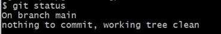

# Git commands

## git config

*git config* is needed once to configure Git locally on a new device. 

You can set your name and email adress that will be saved with every commit.

```bash
git config --global user.name "Isabella Kainer"
git config --global user.email "isabella.kainer@edu.fh-joanneum.at"
```

You can also set teh default branch to *main*, so all your projects will be initialized in *main* in the future.

```bash
git config --global init.defaultBranch main
```

## git init

With *git init* you are able to initialize/create a new repository. Therefore create a new directory in your file system, which is meant to be the repository root, then jump into that directory and use the command *git init*.

```bash
mkdir MyRepository
cd MyRepository
git init
```

Don't use *git init* if you have to copy an existing repository from a server like Github. Use *git clone \<url>* instead.

```bash
mkdir MyRepository
cd MyRepository
git clone https://github.com/isakain/msd21_kainer_isabella.git 
```
## git status

With this command you can see, which files currently are in the staging area and which files are untracked.

```bash
git status
```

Status after commiting .gitignore with all files that you don't want to add to the staging area but also should not show up as untracked:


## git add

*git add \<filename>* enables you to add a file (that is located in your repository root) to the staging area.

```bash
git add README.md
```

## git commit

*git commit -m "\<message>"* releases all files in the staging area as a new version to the git repository. The message in the command describes the changes that have been made for this version.

```bash
git commit -m "Added .gitignore"
```

## git log

*git log* shows you all the previous commits of this repository. So it's kind of a history.

```bash
git log
```

## git diff

Shows differences between two commits or a commit and a working directory.

## git pull

When you have already worked on a repository locally and you want to get the newest version of it from a server (like Github), then you can use *git pull \<url> to update all your files in the repository.

```bash
git pull https://github.com/isakain/msd21_kainer_isabella.git
```

## git push

With *git push \<url>* you can upload your local changes of a repository on the server where the repository can be accessed from all team members.

```bash
git push https://github.com/isakain/msd21_kainer_isabella.git
```