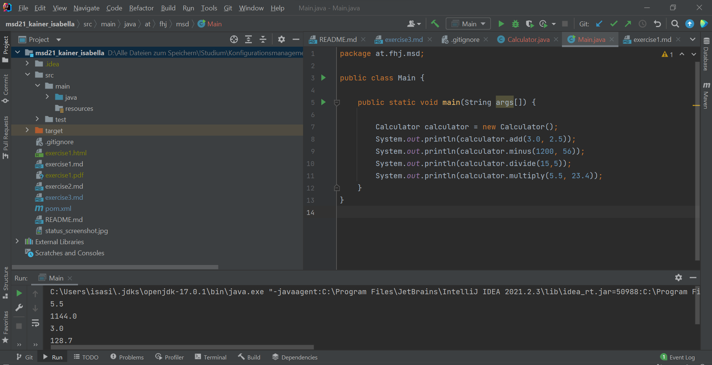
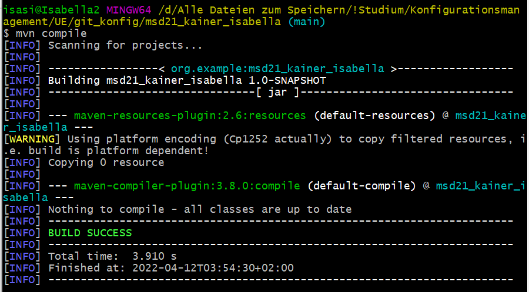
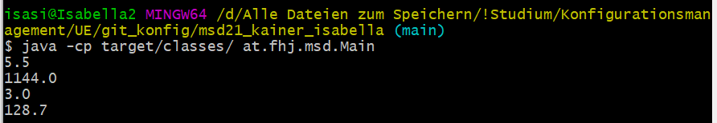

# Exercise 3

## Information
If you don't have any files in a folder, this folder won't show up at *git status*!

.idea folder and generated files like class files/target folder should be ignored (add it to .gitignore)

## Target folder
After the first execution of the program, a target folder is created.
This folder includes all classes as read-only class files.

Screenshot:

## mvn compile
With *mvn compile* you can build a project.

Screenshot:

## Execution of the main class in the command line

Screenshot:
