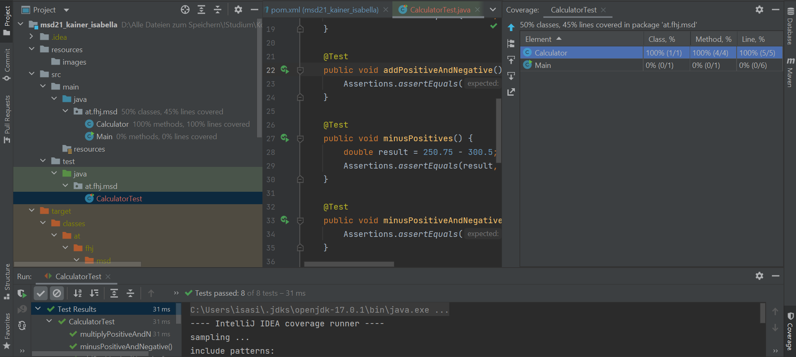
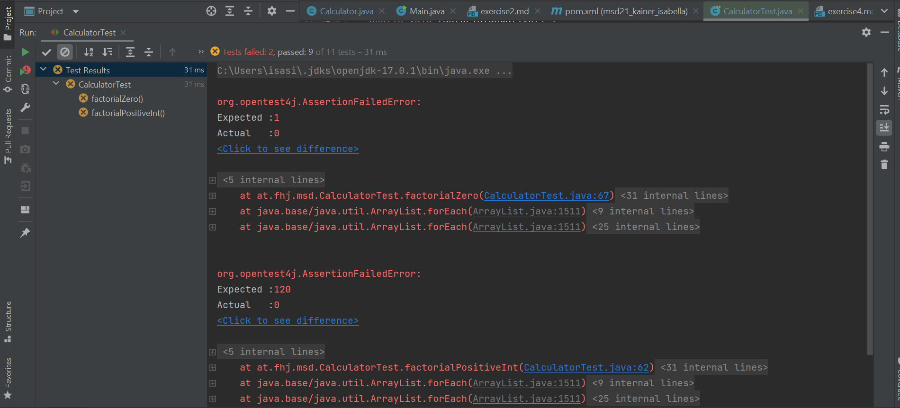

# Exercise 4

## What has been tested?

### add-method
For the add-method the following scenarios have been tested:
* The addition of 2 positive doubles: 12.1 + 50.2 = 62.3
* The addition of one positive and one negative double: 12 + (-10) = 2

### minus-method
For the minus-method the following scenarios have been tested:
* The subtraction of 2 positive doubles, where the second one is bigger than the first one: 250.75 - 300.5 = -49.75
* The subtraction of one positive and one negative double: 30 - (-10) = 40

### multiply-method
For the multiply-method the following scenarios have been tested:
* The multiplication of 2 positive double values: 2.5 * 40 = 100
* The multiplication of one positive and one negative double, so the result has to be a negative double: 50 * (-3) = -150

### divide-method
For the divide-method the following scenarios have been tested:
* The division of 2 positive double values, which results in an infinite period number, that should match the expected value with a delta of 0.05: 2 / 3 = 0.67
* The division of one negative and one positive double, so the result is a negative double: -55.0 / 2 = -27.5

## Test coverage

## Failed tests for factorial method

Info: The last test, which checks the result for the factorial of a negative number (which should return 0 according to the assignment), does not fail because the factorial method that has not been implemented yet returns 0 by default.